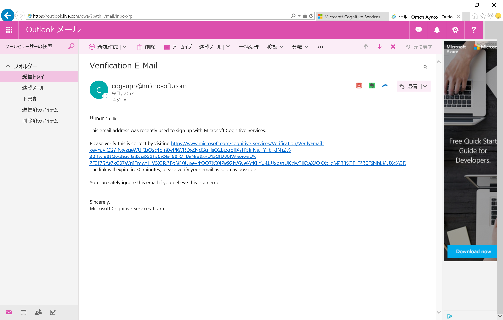

# Cognitive Services の無料サブスクリプションの申し込み方法
Microsoft Cognitive Services は 画像、文章、言語、情報を処理する機能を API 経由で利用できるサービスです。
Cognitive Services は無料で試用できますが、予めサブスクリプション申し込みが必要です。以下、Cognitive Services のサブスクリプションの申し込み手順を紹介します。

方法は2通りあります。

**[1. 7日間無料版](#1-7日間無料版の申し込み方法)**
- [Cognitive Services の 試用申し込みサイト](https://azure.microsoft.com/ja-jp/try/cognitive-services/) から申込
- Microsoft / LinkedIn / GitHub / Facebook いずれかのアカウント に紐づけ

**[2. Free Tier(F0): (当面)無料の料金プラン](#2-azure-portal-から-free-tierf0-無料プラン-の申し込み方法)**
- [Azure Portal](https://portal.azure.com/) から申込
- Azure サブスクリプション & Microsoft アカウント に紐づけ

とにかく手軽に使ってみたい方は **1. 30日間無料版** を、これまでに Azure を使ったことがあって Azure サブスクリプションを持っている方は **2. Free Tier(F0)** がおススメです。

  

**今回のハンズオンでは** 
- PowerApps 編の方は **[7日間無料版](#1-7日間無料版の申し込み方法)**
- Logic Apps 編の方は **[2. Free Tier(F0)](#2-azure-portal-から-free-tierf0-無料プラン-の申し込み方法)**

**で申し込みを行います。**

  
  
 
# 1. 7日間無料版の申し込み方法

## Microsoft アカウント または Microsoft365 (組織) アカウント
サブスクリプションの申し込みに必要となりますので、持っていない場合は取得しておきます。

>[Microsoft アカウント登録手続き](https://www.microsoft.com/ja-jp/msaccount/signup/default.aspx)

## Cognitive Services サブスクリプション申し込み

ブラウザから [microsoft.com/Cognitive](http://microsoft.com/Cognitive) にアクセスして Cognitive Services のページを開き、[Cognitive Services を無料で試す] をクリックします。

*Cognitive Services を試す* というページで、*Face API* の行にある [API キーの取得] をクリックします。

サービス要件を確認して ☑ (チェック) をつけ、国/地域 を選択、[次へ] をクリックします。

[サインインして API を作成する] の ダイアログから [Microsoft] をクリックして、Microsoft (or Microsoft365) アカウントでサインインします。

>サブスクリプション申し込み時に Email Verification (認証) が必要になる場合があります。メールに記載されている URL をクリックして認証が完了すると、次のステップに進めるようになります。

*正常にサブスクリプションに追加しました* と表示されたら完了です。

*キー1* に記載されている文字列が サブスクリプション(API)キー になります。

*エンドポイント* (Web API のアクセス URL) が表示されている場合は、**このキーはこちらの URL のみで有効です**。

**キー** と **エンドポイント** の両方をコピーしてローカルに保存しておきます。

# 2. Azure Portal から Free Tier(F0) 無料プラン の申し込み方法

## Azure サブスクリプション
サブスクリプションの申し込みに必要となりますので、持っていない場合は取得しておきます。

>[Azure の無料サブスクリプションの申し込み方法](https://github.com/ayako/AAJP-EmotionBotHoL/blob/master/AzureSubscriptionTrial.md)

## Azure Portal から Cognitive Services APIs のサービス作成

[Azure Portal](https://portal.azure.com/) にアクセスし、有効なサブスクリプションが紐づけられているアカウントでサインインします。

左バーの [+リソースの作成] をクリックし、*新規* パネルから [AI + Machine Learning] をクリックしてAPIを表示します。

利用したい API が表示されない場合は、*すべて表示* をクリックします。

表示された API、または 検索を利用して 利用したい API を表示させます。
今回は **Face API** を選択して Face API を申し込みます。(他の API も手順は同じです。)

*Face API 作成* パネルで、以下の情報を入力＆選択します。

- 名前: FaceAPIxxx など、ご自身で認識しやすいもの
- サブスクリプション: (自動入力)
- 場所: Azure データセンターの拠点、今回は 米国西部 (West US) を選択します。
- 価格レベル: F0 (無料版)
- リソースグループ: 新規作成でご自身で認識しやすいもの

[作成] をクリックすると、サービスが作成されます。

*展開が成功しました* と表示されて作成が完了したら、[リソースに移動]をクリックして、詳細を表示します。

*Quick Start* ペインが表示されたら、左列のメニューから [Overview] をクリックします。

*Endpoint* (エンドポイント: Web API のアクセス URL) に記載されている URL をローカルに保存しておきます。

左列の *RESOURCE MANAGEMENT* (リソース管理) の欄にある [Keys] をクリックします。

*Key1* に記載されている文字列が API キー になります。こちらをコピーしてローカルに保存しておきます。

このキーは先ほど表示したエンドポイントのみで有効です。

