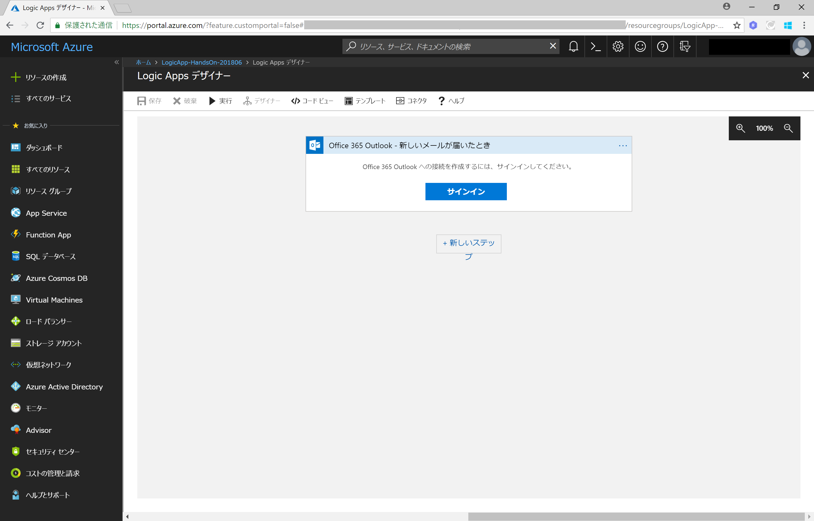

# Cognitive Services 活用! Microsoft PowerApps & Flow / Azure Locig Apps によるノンコーディング開発 

## Azure Logic Apps を活用した、お問い合わせアラートシステムの開発

今回は Webサイトのお問い合わせフォームまたはメールによる、顧客からのお問い合わせメールの内容を判別するシステムを構築します。
Azure Locig Apps を利用して、ノンコーディングで下記のフローを構築します。

- メールを受信したら、メール件名からお問い合わせメールを判別
- Cognitive Services Text Analytics API を利用した Sentiment(ネガポジ)分析を行い、
  - お問い合わせに対して自動で受付返答メールを送信
  - お問い合わせメールの内容をお問い合わせメール DB (Sharepoint に保存した Excel ファイル)  に保存

### 準備するもの

#### Azure サブスクリプション

持っていない場合は無料評価版でOKですので取得しておきます。

>[Azure の無料サブスクリプションの申し込み方法](https://github.com/ayako/AAJP-EmotionBotHoL/blob/master/AzureSubscriptionTrial.md)

#### Cognitive Services Text Analytics の API Key

[Cognitive Services の無料サブスクリプションの申し込み方法: 2. Free Tier(F0)](https://github.com/ayako/NonCodingCognitive_201806/blob/master/CognitiveSubscriptionTrial.md#2-azure-portal-%E3%81%8B%E3%82%89-free-tierf0-%E7%84%A1%E6%96%99%E3%83%97%E3%83%A9%E3%83%B3-%E3%81%AE%E7%94%B3%E3%81%97%E8%BE%BC%E3%81%BF%E6%96%B9%E6%B3%95) の手順で **Text Analytics** のサービスを申し込み、API Key を取得しておきます。
 
#### Office 365 アカウント (Office 365 Business Premium)

Outlook Online, Excel Online, Sharepoint Online を使用します。持っていない場合は無料評価版でOKですので取得しておきます。

>[法人向け Office 365](https://products.office.com/ja-jp/compare-all-microsoft-office-products?tab=2)

 
 

## 手順

### 1. メール内容保存 DB (Excel ファイル) の作成

  

  

  

  

  

  

### 2. Azure Logic Apps の新規アプリ作成

  

  

  

  

  

  

  

### 3. メールの受信: Office 365 Outlook コネクターの設定

  

  

  

### 4. メール本文の取り出し: Content Conversion (HTML to Text) コネクターの設定

  

  

  

  

### 5. メール件名による条件分岐

  

  

  

  

### 6. メール本文のネガポジ判別(1): Microsoft Translator コネクターの設定

  

  

  

### 7. メール本文のネガポジ判別(2): テキスト分析 (Text analytics) コネクターの設定

  

  

  

  

### 8. ネガポジ判定による条件分岐

  

  

  

### 9. ネガ判定時のアクション設定(1): メール送信

  

  

### 10. ネガ判定時のアクション設定(2): DB 保存

  

  

  

  

  

  

  

### 11. ポジ判定時のアクション設定

  

  

  

### 12. Logic Apps の実行テスト

  

  

  

  

  

  

  

  

  

