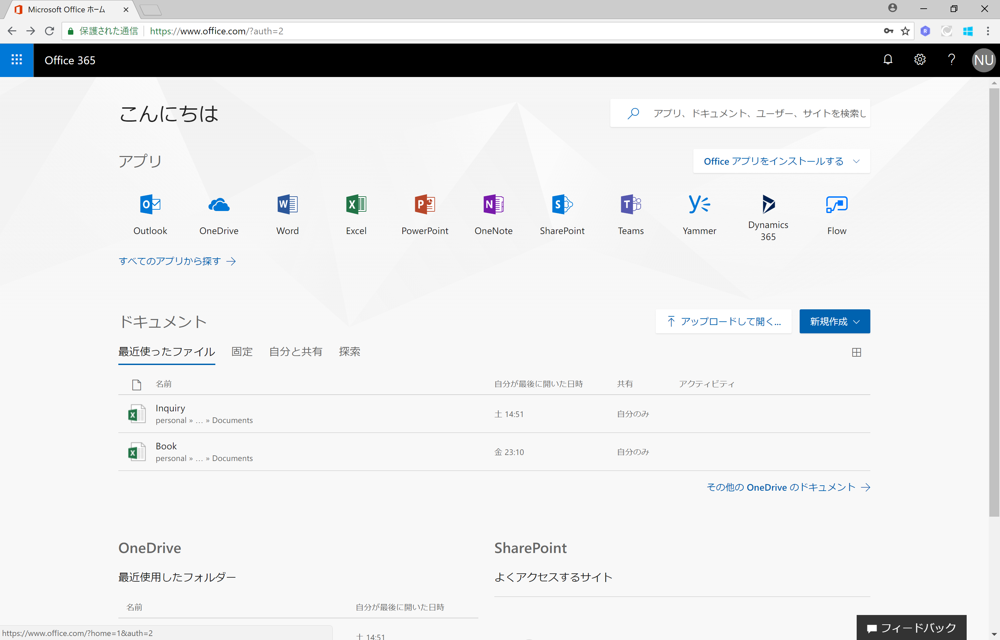
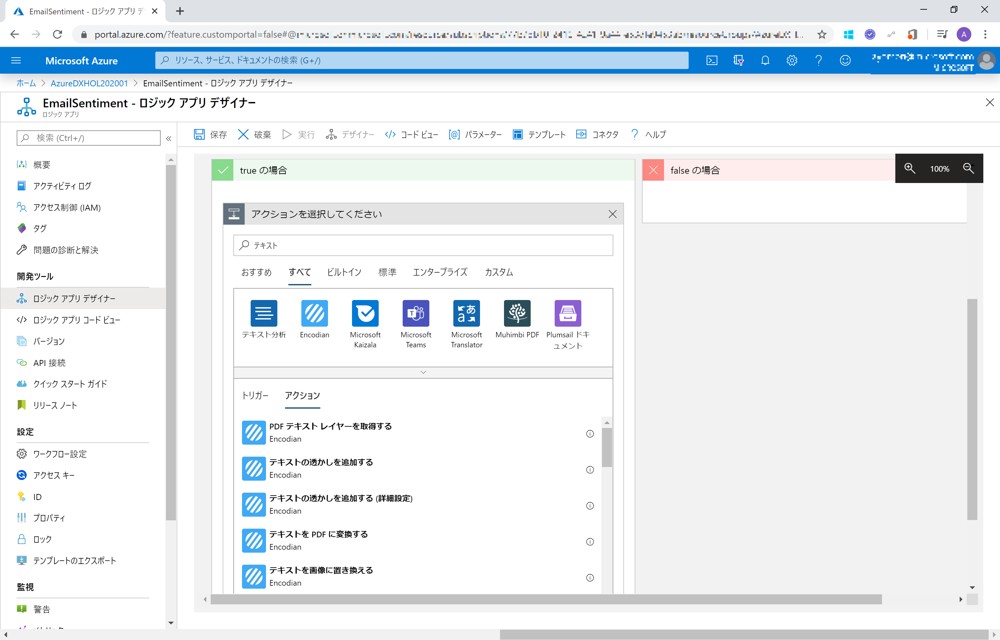
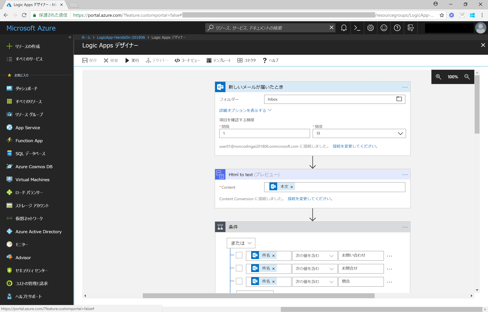
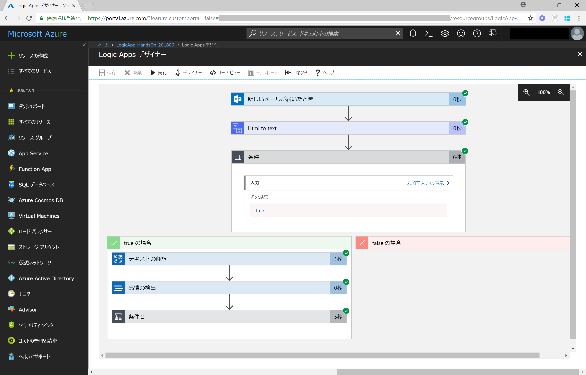

# Cognitive Services 活用! Microsoft PowerApps & Flow / Azure Locig Apps によるノンコーディング開発 

## Azure Logic Apps を活用した、お問い合わせアラートシステムの開発

今回は Webサイトのお問い合わせフォームまたはメールによる、顧客からのお問い合わせメールの内容を判別するシステムを構築します。
Azure Logic Apps を利用して、ノンコーディングで下記のフローを構築します。

- メールを受信したら、メール件名からお問い合わせメールを判別
- Cognitive Services Text Analytics API を利用した Sentiment(ネガポジ)分析を行い、
  - お問い合わせに対して自動で受付返答メールを送信
  - お問い合わせメールの内容をお問い合わせメール DB (OneDrive に保存した Excel ファイル)  に保存

### 準備するもの

#### Azure サブスクリプション

持っていない場合は無料評価版でOKですので取得しておきます。

>[Azure の無料サブスクリプションの申し込み方法](https://github.com/ayako/AAJP-EmotionBotHoL/blob/master/AzureSubscriptionTrial.md)

#### Cognitive Services Text Analytics の API Key

[Cognitive Services の無料サブスクリプションの申し込み方法: 2. Free Tier(F0)](https://github.com/ayako/NonCodingCognitive_201806/blob/master/CognitiveSubscriptionTrial.md#2-azure-portal-%E3%81%8B%E3%82%89-free-tierf0-%E7%84%A1%E6%96%99%E3%83%97%E3%83%A9%E3%83%B3-%E3%81%AE%E7%94%B3%E3%81%97%E8%BE%BC%E3%81%BF%E6%96%B9%E6%B3%95) の手順で **Text Analytics** のサービスを申し込み、API Key を取得しておきます。

- 手順は **Face API** の申し込みの例なので、 **Text Analytics API** に置換えて実施してください。
- **Text Analytics API** を作成する「場所」は、「米国西部」（West US）を指定してください。

#### Office 365 アカウント (Office 365 Business Premium)

Outlook Online, Excel Online を使用します。持っていない場合は無料評価版でOKですので取得しておきます。

>[法人向け Office 365](https://products.office.com/ja-jp/compare-all-microsoft-office-products?tab=2)

 
 

## 手順

### 1. メール内容保存 DB (Excel ファイル) の作成

[Office Online のサイト](https://www.office.com) にアクセスしてログインします。

  

最初にお問い合わせ DB となる Excel を作成します。 Office Online のホーム画面 から **Excel** をクリックして、**新しい空白のブック** をクリックして作成します。

  

Excel ブック の Sheet1 の 1 行目 A1~E1 のセル に **受信日時** **メールアドレス** **メール内容** **スコア** **クレーム** と入力します 

  

A1~E1 のセルを選択し、ツールバーの **テーブルとして書式設定** をクリックします。

*先頭行をテーブルの見出しとして設定する* にチェックをつけて、[**OK**] をクリック、テーブルの設定を行います。

  

  

ツールバーの **ファイル** > **名前を付けて保存** をクリックして、**名前を付けて保存** をクリックします。

**LogicApps-HandsOn** という名前を付けてExcelブックを保存します。これで、お問い合わせメール DB としての設定が完了です。

  

 

### 2. Azure Logic Apps の新規アプリ作成

[Azure Portal](https://portal.azure.com) をブラウザーで開き、Azure サブスクリプションを申し込んだアカウントでサインインします。

  

**+リソースの作成** をクリックして、検索欄に **Logic App** と入力して、Logic Apps を検索、一覧から **Logic App** をクリックし、*Logic App* ペイン で [**作成**] をクリックして、新規作成手順に進みます。

  

*ロジック アプリの作成* ペインで、*名前* にお好みの名前を入力し、*リソースグループ* は **新規作成** を選択してお好みのグループ名を入力します。[**作成**] をクリックして、Logic Apps アプリを作成します。

  

*作成が完了しました* というメッセージが表示されたら、クリックして、作成した Logic Apps アプリを表示します。

  

自動で表示される (または Logic Apps アプリ のメニューから **ロジックアプリデザイナー** をクリック)、*ロジックアプリデザイナー* からロジックの作成を行います。

  

 

### 3. メールの受信: Office 365 Outlook コネクターの設定

*Logic Apps デザイナー* 画面を下にスクロールして、*テンプレート* を表示、**空のロジックアプリ** をクリックして、空白の状態からフローの作成を開始します。

  

フローを開始するためのトリガーを設定します。検索欄に **Outlook** と入力して、Outlook 365 の特定のアカウントに対するトリガーを検索します。

  

**Office 365 Outlook - 新しいメールが届いたとき** をクリックして選択します。

  

*Office 365 Outlook - 新しいメールが届いたとき* のアクションで、トリガーとなる Office 365 Outlook のアカウントを設定するため、[**サインイン**] をクリックして、該当するアカウントの情報でサインインを行います。

  

*Office 365 Outlook - 新しいメールが届いたとき* のアクション詳細設定で、メールを確認する頻度を設定します。ここではテストを行いやすくするため、間隔を **1分** に設定します。

  

 

### 4. メール本文の取り出し: Content Conversion (HTML to Text) コネクターの設定

[**＋新しいステップ**] をクリック、[**アクションの追加**] をクリックして、次のアクションを追加します。

  

検索欄に **html** と入力し、**Content Conversion - Html to text** をクリックして選択します。

>受信するメールが html 形式の場合を考慮し、本文を Plain text として抽出するためのステップです。 

  

*Html to text* のアクション詳細設定で、*Content* の欄をクリックします。

  

表示される *動的コンテンツ* 一覧から **本文** をクリックして、*Content* に設定します。

  

 

### 5. メール件名による条件分岐

[＋新しいステップ] をクリック、[条件の追加] をクリックして、条件分岐を追加します。

  

条件の詳細設定と、条件に対して True の場合 と False の場合の条件分岐が設定されます。

  

条件の詳細設定で、左欄の値に 動的コンテンツから **件名** をクリックして設定、条件として **次の値を含む** を選択、右欄の値に **お問い合わせ** と入力して、メールの件名に "お問い合わせ" を含む場合、という条件を設定します。

その後、[**And**] を **または** に変更し、[**＋追加**] をクリックして **行の追加** を選択して条件を追加します。

  

同様に **件名**　に "お問合せ" や　"問合せ" といった文言を含む場合、という条件を設定します。

  

 

### 6. メール本文のネガポジ判別(1): Microsoft Translator コネクターの設定

※直接 Text Analyitics に接続する方法に変更いたします。(操作なし)

### 7. メール本文のネガポジ判別(2): テキスト分析 (Text analytics) コネクターの設定

[**アクションの追加**] をクリックして、次のアクションを追加します。アクションの検索欄に **テキスト** と入力します。

  

次のアクションとして、**テキスト分析 - 感情の検出** を選択します。

  

*テキスト分析* の接続設定で以下の情報を入力します。

- **接続名** : Text Analytics
- **アカウントキー** : Text Analytics の API Key
- **サイトのURL** : Text Analytics 申込時にロケーションに West US を選択した場合は未入力でOK、それ以外の場合は https://ロケーション名.api.cognitive.microsoft.com と入力

[作成] をクリックして、*テキスト分析 - 感情の検出* アクションを作成します。

  

*テキスト分析 - 感情の検出* アクションの詳細設定で、パラメーターを選択します。*パラーメーターの追加* をクリックし、表示される **テキスト** と **言語** のチェックボックスをクリックして ✔ (チェック) をつけます。

  

**テキスト** には 動的コンテンツから **The plain text content** をクリックして選択、**言語** は **ja** を選択します。

  

 

### 8. ネガポジ判定による条件分岐

Text Analytics API では、ネガティブ(0)~ニュートラル(0.5)~ポジティブ(1) として、0~1の間の数値でネガポジ分析結果が返されます。
メール本文のネガポジ分析の結果、0.3未満 (ネガティブの可能性が高い) メールについては、それに対応したメールを自動送信し、問い合わせ DB にメールの内容とネガポジ分析結果を保存します。

*感情の検出* アクションの直後、**さらに追加**　をクリックした後 **条件の追加** をクリックして条件分岐を追加します。

  

条件の左欄には動的コンテンツから *感情の検出* アクションで取得した **スコア** を選択します。

  

条件は **次の値未満**、条件の右欄には **0.3** と入力します。

  

 

### 9. ネガ判定時のアクション設定(1): メール送信

条件が True (*感情の検出* アクションのスコアが 0.3 未満) の場合のアクションを追加します。

アクションの選択の検索欄に **outlook** と入力し、**Office 365 Outlook - メールの送信** を選択、メール自動送信を行うアカウントでサインインします。

  

*メールの送信* アクションの詳細設定で、下記の通り設定します。

- **宛先** : 動的コンテンツから **差出人** を選択
- **件名** : お問い合わせ有難うございました (他、お好きな件名を入力します)
- **本文** : (お好きな内容を入力します)

  

 

### 10. ネガ判定時のアクション設定(2): DB 保存

*メールの送信* アクションの直後、[**アクションの追加**] をクリックしてアクションを追加します。

  

アクションの検索欄に **excel** と入力、**Excel Online Business** を選択します。

  

**Excel Online (Business)** のアクション一覧から **Excel Online (Business) - Add a row into a table** を選択します。

  

*Add a row into a table* アクションの詳細設定で、以下を設定します。

- **Location** : OneDrive for Business
- **Document Library** : OneDrive
- **File** : お問い合わせ DB (1. で作成したExcelファイル) を選択します
- **Table** : お問い合わせ DB (1. で作成したExcelファイル) のテーブルを選択します。

  

Excel ファイルのテーブルが読み込まれると、テーブルの見出しが自動で読み込まれて表示されます。

  

以下の内容を設定します。

- **受信日時** : 動的コンテンツから **受信日時**
  - ※ 動的コンテンツの「新しいメールが届いたとき」の一覧に **受信日時** が見つからないときは、「もっと見る」をクリックして表示を増やしてみてください。
- **メールアドレス** : 動的コンテンツから **差出人**
- **メール内容** : 動的コンテンツから **The plain text content**
- **スコア** : 動的コンテンツから **スコア**
- **クレーム** : high

  

  

 

### 11. ポジ判定時のアクション設定

メール本文のネガポジ分析のスコアが 0.3 以上の場合は、通常対応のメールを自動送信し、問い合わせ DB にメールの内容とネガポジ分析結果を保存します。ネガ判定時の場合と同様の設定を行います。

それでは、スコア判定の条件のうち、 False (*感情の検出* アクションのスコアが 0.3 以上) の場合のアクションを追加します。

**アクションの追加** をクリックして、**Office 365 Outlook - メールの送信** を選択、詳細設定で以下の内容を設定します。

- **宛先** : 動的コンテンツから **差出人** を選択
- **件名** : お問い合わせ有難うございました (他、ネガ判定とは異なるお好きな件名を入力します)
- **本文** : (ネガ判定とは異なるお好きな内容を入力します) 

  

  

**アクションの追加** をクリックして、**Excel Online (Business) - Add a row into a table** を選択、詳細設定で以下の内容を設定します。

- **Location** : OneDrive for Business
- **Document Library** : OneDrive
- **File** : お問い合わせ DB (1. で作成したExcelファイル) を選択します
- **Table** : お問い合わせ DB (1. で作成したExcelファイル) のテーブルを選択します
- **受信日時** : 動的コンテンツから **受信日時**
- **メールアドレス** : 動的コンテンツから **差出人**
- **メール内容** : 動的コンテンツから **The plain text content**
- **スコア** : 動的コンテンツから **スコア**
- **クレーム** : low

  

これでフローの設定は完了です。最終的なフローは以下のようになります。

  

ここまで完了しましたら、画面上部の「保存」をクリックし、忘れずに保存してください。

 

### 12. Logic Apps の実行テスト

設定した Logic App アプリのフローを確認するため、アプリを実行して、問い合わせメールを送信、動作を確認します。

Logic Apps デザイナー のツールバー の **▶実行** をクリックします。

  

メール受信待ちになったら、問い合わせメールを送信します。

  

Outlook のアドレス宛に、それ以外のメールアドレスからメールを送信します。

- 件名 : お問い合わせ
- 本文 : 困っています。至急連絡ください (その他、ネガ判定となりそうな文章を入力)

  

メールが受信されてしばらくしてフローに設定されたアクションが行われ、成功したアクションには 緑色のチェックマーク (✓) が表示されます。

  

チェックマーク (✓) が表示されているアクションをクリックすると、アクションの入出力値が確認できます。

  

無事フローが終了すると、メールを送信したアドレスに自動返答メールが送られ、また、問い合わせ DB (Excel ファイル) に内容が入力されているのを確認してください。

  

  

フローの動作確認が終了したら、不要な課金などを避けるため、Logic App の設定で **無効** をクリックして、フローの稼働を止めておきます。(再度稼働させる場合は、**有効** をクリックして稼働可能な状態に戻します。)

  

